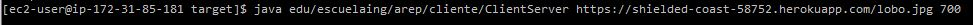

# AREP-LAB-05-INTRODUCCION-AWS

Este programa implementa un servidor concurrente y un cliente que le realizara peticiones concurrentes al servidor.

[](https://circleci.com/gh/cdavidd/AREP-LAB-05-INTRODUCCION-AWS)

## Heroku

https://shielded-coast-58752.herokuapp.com/

Ejemplos:

- https://shielded-coast-58752.herokuapp.com/index.html
- https://shielded-coast-58752.herokuapp.com/lobo.jpg
- https://shielded-coast-58752.herokuapp.com/leon.jpg
- https://shielded-coast-58752.herokuapp.com/alert.js

## Empezando

Estas instrucciones ofrecerán una guía de como utilizar la copia del programa que usted podrá tener en su maquina local para fines de desarrollo y prueba.

### Prerrequisitos

**Java**

Se necesitara del java JDK 1.8, para verificar que se tiene abriremos nuestra terminal o consola de comando y ejecutaremos el siguiente comando:

```
java -version
java version "1.8.0_221"
Java(TM) SE Runtime Environment (build 1.8.0_221-b11)
Java HotSpot(TM) 64-Bit Server VM (build 25.221-b11, mixed mode)
```

En caso de no tenerlo se podra descargar de [java](https://www.oracle.com/technetwork/java/javase/downloads/jdk8-downloads-2133151.html)

**Maven**

Se necesitara de Maven para ejecutar el programa, para eso se verificara si se tiene con `mvn -v` en caso de no tenerlo se podrá hacer [aqui](https://maven.apache.org/install.html)

**Heroku**

Para correrlo localmente mediante heroku asegurece de terner el CLI de este con el comando `heroku --version`

```
heroku/7.37.0 win32-x64 node-v12.4.0
```

### Instalación

- Realizaremos el siguiente comando desde la consola para clonar el repositorio `git clone https://github.com/cdavidd/AREP-LAB-05-INTRODUCCION-AWS`
- Luego realizaremos `mvn package` para descargar las dependencias.

### Ejecucion programa

- Servidor
  `mvn exec:java -Dexec.mainClass="edu.escuelaing.arep.servidor.HttpServer"`
- Cliente
  `mvn exec:java -Dexec.mainClass="edu.escuelaing.arep.cliente.ClientServer" -Dexec.args="<url> <numero de peticiones>"`

  - Ejemplo
    `mvn exec:java -Dexec.mainClass="edu.escuelaing.arep.cliente.ClientServer" -Dexec.args="https://shielded-coast-58752.herokuapp.com/index.html 10"`

### Ejecutando las pruebas

Se probo el servicio del cliente desde la maquina de aws con respeto al tiempo de respuesta.

- Peticion a recurso html


- Peticion a recurso img





## Generar javaDocs

Para generar el javaDocs utilizaremos `mvn javadoc:javadoc`

## Docuemento del Diseño

- [Diseño](https://github.com/cdavidd/AREP-LAB-05-INTRODUCCION-AWS/blob/master/arep_lab_05_intro_aws.pdf)

## Docuemento del taller

- [Taller pruebas](https://github.com/cdavidd/AREP-LAB-05-INTRODUCCION-AWS/blob/master/Taller-introduccion.pdf)

## Autores

- Cristian López

## Licencia

- GNU General Public License v3.0
